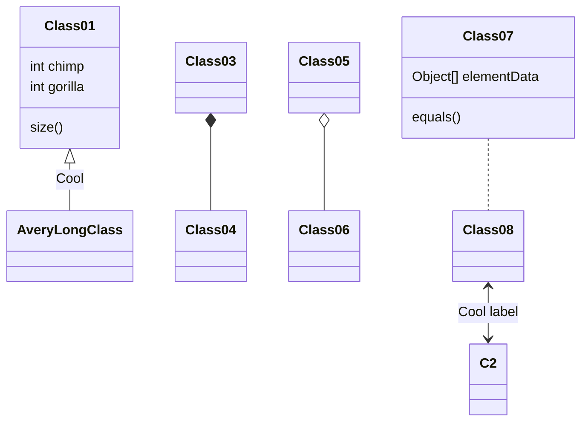

In order to include [mermaid] diagram, add the following attribute to the page metadata section:

```
---
mermaid: true
---
```
You may then start adding diagrams. 

## Diagrams
To embed diagrams, add code block section labeled with `mermaid` as a language:

````

````


[mermaid]: https://mermaid-js.github.io/mermaid/#/
